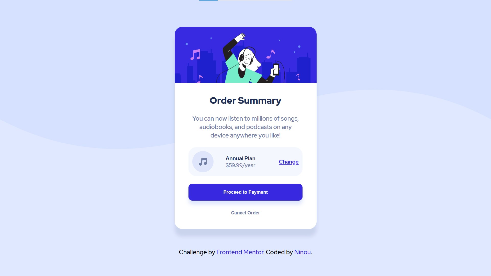

# Frontend Mentor - Order summary card solution

This is a solution to the [Order summary card challenge on Frontend Mentor](https://www.frontendmentor.io/challenges/order-summary-component-QlPmajDUj). Frontend Mentor challenges help you improve your coding skills by building realistic projects. 

## Table of contents

- [Overview](#overview)
  - [The challenge](#the-challenge)
  - [Screenshot](#screenshot)
  - [Links](#links)
- [My process](#my-process)
  - [Built with](#built-with)
  - [What I learned](#what-i-learned)
  - [Continued development](#continued-development)
  - [Useful resources](#useful-resources)
- [Author](#author)
- [Acknowledgments](#acknowledgments)

## Overview

### The challenge

Users should be able to:

- See hover states for interactive elements

### Screenshot

This is a screenshot of my own solution 

### Links

- Solution URL: (https://bit.ly/38CPMQ1)
- Live Site URL: (https://bit.ly/3n218Fu)

## My process

### Built with

- HTML5 markup
- CSS custom properties
- Flexbox

### What I learned

I've learned the importance of the good analysis of the prototype before to start truning it into code due to the trobule that I faced and that took much time from me then I excpected because of my the insufficient that I did in this project.

### Continued development

In the future, I want to learn more about prototype analysis and improve myself with flexbox and grid properties

## Author

- Frontend Mentor - [@Ninou01](https://www.frontendmentor.io/profile/Ninou01)
